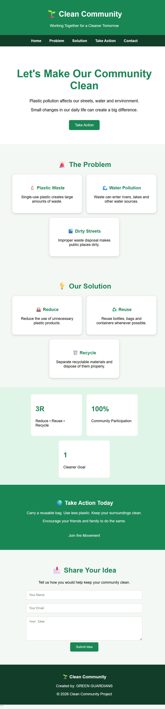

```markdown
# 🌱 Clean Community

## About the Project

Clean Community is a simple website created to raise awareness about plastic waste and improper waste disposal.

## Problem

Plastic waste and improper disposal can make public places dirty and cause environmental pollution.

## Objectives

- Raise awareness about plastic pollution.
- Encourage proper waste disposal and recycling.
- Promote a cleaner and greener community.

## Key Features

- Problem Awareness
- Simple Solutions
- Reduce, Reuse and Recycle
- Take Action Section
- Statistics Section
- Feedback Form
- Mobile-Friendly Design

## Technologies Used

- HTML5
- CSS3
- UTF-8
- Responsive CSS

## Target Users

- Students
- Faculty
- General Public
- Organisations

## SDG Goals

- SDG 11 – Sustainable Cities and Communities
- SDG 12 – Responsible Consumption and Production

## CC Website Photo



# My Project

## 🌐 Live Website

[🚀 Open Clean Community Website](https://kavinrajts.github.io/Clean-Community-Website/)

## Conclusion

The Clean Community webpage creates awareness about plastic waste and encourages people to follow simple practices for a cleaner and greener community.

## Team

**Team Name:** Green Guardians
```
